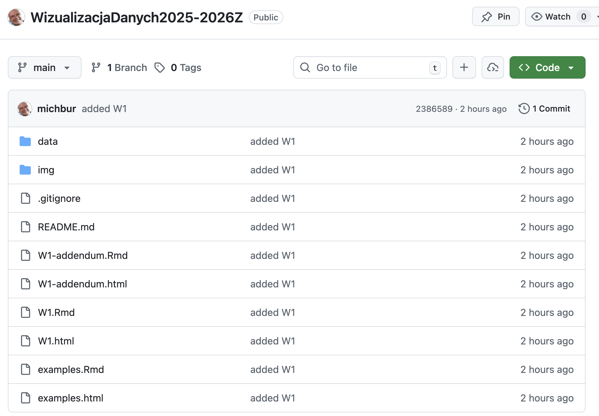
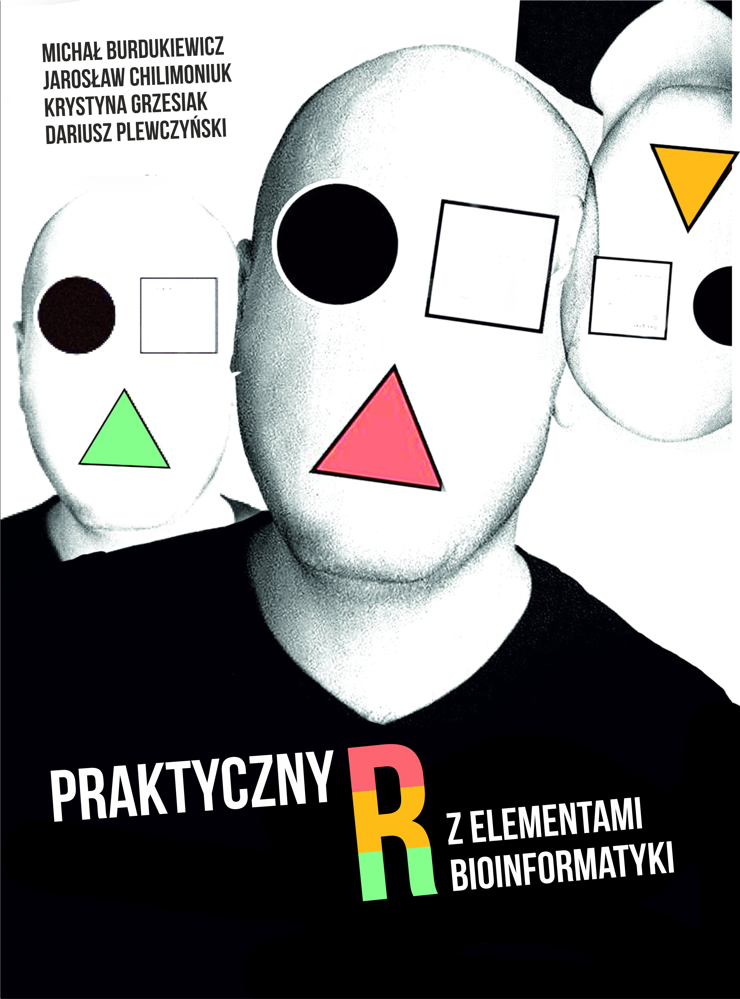
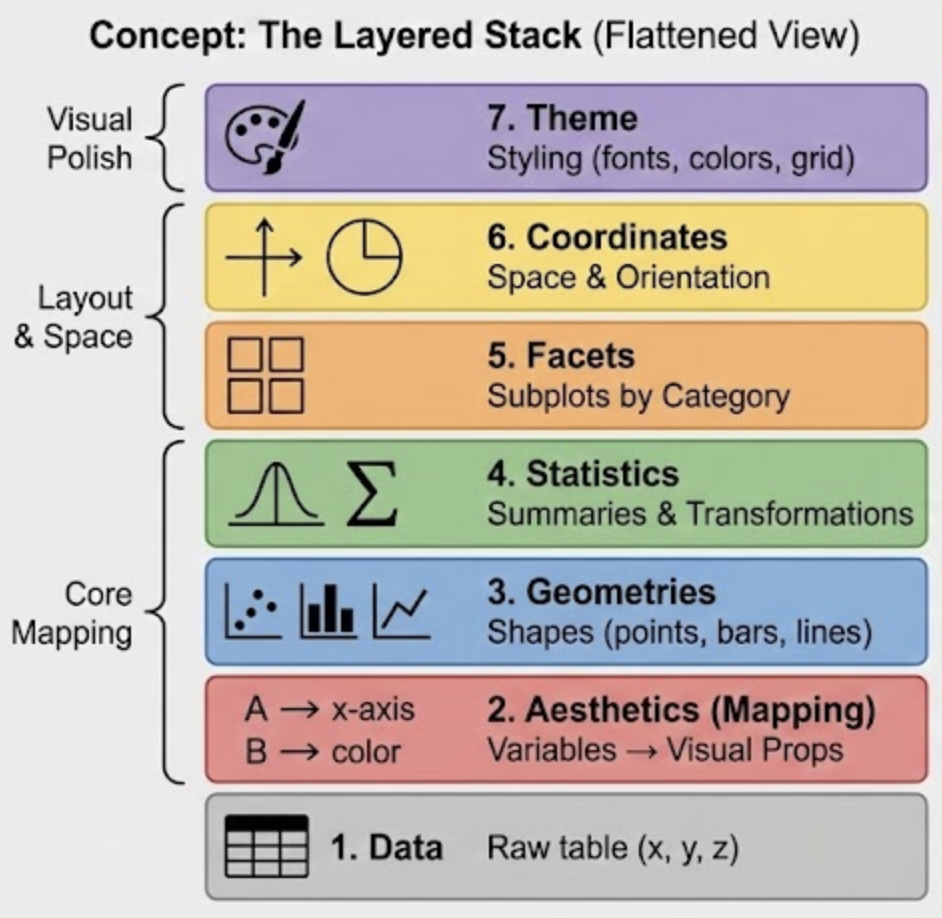
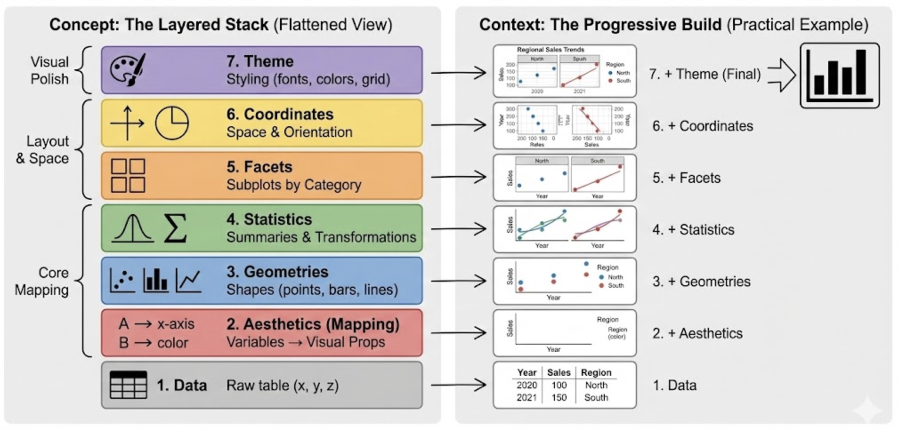
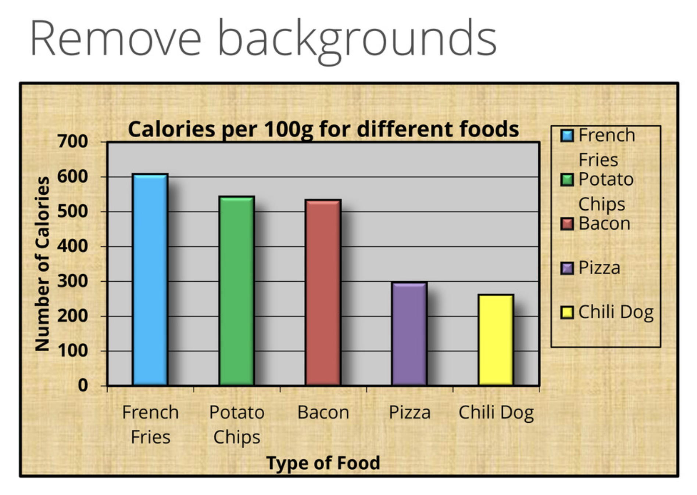

<link href="https://fonts.googleapis.com/css?family=Montserrat&display=swap" rel="stylesheet">

<style>
slides > slide {
  font-family: 'Montserrat', sans-serif;
}

.center {
  display: block;
  margin-left: auto;
  margin-right: auto;

}


</style>


```{r setup, include=FALSE}
library(ggplot2)
library(plotly)
library(dplyr)
library(patchwork)
library(ggthemes)
library(knitr)
# opts_chunk$set(echo = FALSE, message = FALSE, warning = FALSE)
# knit_hooks$set(webgl = hook_webgl)
data("midwest", package = "ggplot2")
options(scipen=999)  # turn-off scientific notation like 1e+48
theme_set(theme_bw())  # pre-set the bw theme.
```

## O mnie

Michał Burdukiewicz:

 - bioinformatyk (Uniwersytet Medyczny w Białymstoku, Vilnius University),
 - lider grupy badawczej BioGenies ([biogenies.info](https://biogenies.info)),
 - 16 lat doświadczenia z R,
 - Stowarzyszenie Wrocławskich Użytkowników R (stwur.pl),
 - Fundacja Why R? (whyr.pl).

Materiały: https://github.com/michbur/WizualizacjaDanych2025-2026Z

Riseup: https://pad.riseup.net/p/WWD-tmp

Mail: michalburdukiewicz@gmail.com


## Materiały




## Literatura

 - Wilke, C. (2020). Podstawy wizualizacji danych. Zasady tworzenia atrakcyjnych wykresów. (https://clauswilke.com/dataviz/)
 - Wilkinson, L. (2005). The Grammar of Graphics.
 - Cairo, A. (2019). How Charts Lie: Getting Smarter about Visual Information.
 - [Engebretsen M., Kennedy H. (2020). Data Visualization in Society](https://www.aup.nl/en/book/9789048543137/data-visualization-in-society).
 - https://data.europa.eu/apps/data-visualisation-guide/.
 
## Praktyczny R z elementami bioinformatyki



W księgarniach pod na początku 2026.
 
## Plan spotkań

1. Czym są wizualizacje danych?
2. Gramatyka grafiki.
3. Błędy w wizualizacjach danych.
4. Narzędzia do wizualizacji danych.
5. Efektywne projektowanie dashboardów.
6. Zaaawansowane wizualizacje danych.

## Plan spotkań

1. **Czym są wizualizacje danych?**
2. **Gramatyka grafiki.**
    - Praca w grupach.
3. **Błędy w wizualizacjach danych.**
    - Praca w grupach.
4. **Narzędzia do wizualizacji danych.**
    - Praca w grupach.
5. Efektywne projektowanie dashboardów.
6. Zaaawansowane wizualizacje danych.

# Historia wizualizacji danych

## Florence Nightingale


## Standardy


Joint Committee on Standards for Graphic Presentation (1915). **Standards for Graphic Presentation**. Publications of the American Statistical Association 14, 790–797.

## Czym są wizualizacje danych?

> **...(a) is based on qualitative or quantitative data and (b) results in an image that is representative of the raw data, which is (c) readable by viewers and supports exploration, examination, and communication of the data...**

$~$

Źródło: Tarek Azzam, Stephanie Evergreen, Amy A. Germuth, and Susan J. Kistler.
Data visualization and evaluation. New Directions for Evaluation, 2013(139):7 
32, 2013.

## Czym są wizualizacje danych?

> **...involves presenting data in graphical or pictorial form which makes the information easy to understand...**

$~$

Źródło: Matthew Sadiku, Adebowale Shadare, Sarhan Musa, Cajetan Akujuobi, and Roy
Perry. Data visualization. International Journal of Engineering Research and
Advanced Technology (IJERAT), 12:2454 6135, 12 2016.

## Czym są wizualizacje danych?

Wizualizacja danych to forma komunikacji. Tak jak każdy komunikat, wykresy muszą być przede wszystkim zrozumiałe dla odbiorcy.

## Rodzaje wizualizacji
```{r, echo=FALSE,warning=FALSE}
ggplot(cbind(expand.grid(x = c("Statyczne\n", "Interaktywne\n"),
                         y = c("Pojedyncza wizualizacja", "Wiele wizualizacji")), 
             software = c("Wykres", "Interaktywny\nwykres", "Infografika", "Dashboard")),
       aes(x = x, y = y, label = software)) +
  geom_tile(fill = NA, color = "black") +
  geom_text()  +
  theme_void() +
  theme(axis.text = element_text(color = "black"))
```

## Wizualizacja statyczna

```{r, echo=FALSE,warning=FALSE}
gg <- ggplot(iris, aes(x = Sepal.Length, y = Sepal.Width, color = Species)) +
  geom_point(size = 4) +
  theme_bw()

gg
```

## 3D


Wykresy 3D w **R**: https://github.com/tylermorganwall/rayshader

## Infografiki

Inspiracje: [VennGage](https://venngage.com/)


## Wizualizacje interaktywne

```{r, echo=FALSE,warning=FALSE}
ggplotly(gg)
```

## Dashboardy


# Gramatyka grafiki

## Gramatyka grafiki

Gramatyka grafiki (grammar of graphics): ustrukturyzowany opis wizualizacji danych.

Wilkinson, L. (2005). The Grammar of Graphics (New York: Springer-Verlag).

## Gramatyka grafiki



## Dane

```{r, echo=FALSE,warning=FALSE}
kable(head(iris))
```


## Atrybuty wizualne 

Atrybuty wizualne (aesthetics): mapowanie danych do osi, kolorów, kształtów.

```{r, echo=FALSE,warning=FALSE}
ggplot(iris, aes(x = Sepal.Length, y = Sepal.Width)) +
  geom_point(size = 4)
```

## Atrybuty wizualne 

```{r, echo=FALSE,warning=FALSE}
ggplot(iris, aes(x = Sepal.Length, y = Sepal.Width)) +
  geom_point(size = 4)
```

**Oś X:** Sepal.Length.
**Oś Y:** Sepal.Width.

## Atrybuty wizualne 

```{r, echo=FALSE,warning=FALSE}
ggplot(iris, aes(x = Sepal.Length, y = Sepal.Width, color = Species)) +
  geom_point(size = 4)
```

**Oś X:** Sepal.Length.
**Oś Y:** Sepal.Width.
**Kolor:** Species.

## Atrybuty wizualne 

```{r, echo=FALSE,warning=FALSE}
ggplot(iris, aes(x = Sepal.Length, y = Sepal.Width, shape = Species)) +
  geom_point(size = 4)
```

**Oś X:** Sepal.Length.
**Oś Y:** Sepal.Width.
**Kształt:** Species.

## Atrybuty wizualne 

```{r, echo=FALSE,warning=FALSE}
ggplot(iris, aes(x = Sepal.Length, y = Sepal.Width, color = Species, shape = Species)) +
  geom_point(size = 4)
```

**Oś X:** Sepal.Length.
**Oś Y:** Sepal.Width.
**Kształt:** Species.
**Kolor:** Species.

## Geometrie

```{r, echo=FALSE,warning=FALSE}
ggplot(iris, aes(x = Species, y = Sepal.Length)) +
  stat_summary(fun.y = "mean", geom = "point")
```

Geometrie: obiekty reprezentujące dane.

## Geometrie

```{r, echo=FALSE,warning=FALSE}
ggplot(iris, aes(x = Species, y = Sepal.Length)) +
  stat_summary(fun.y = "mean", geom = "bar")
```

## Fasety

```{r, echo=FALSE,warning=FALSE}
mutate(iris, 
       Petal.Length = cut(Petal.Length, 
                          breaks = c(min(Petal.Length), median(Petal.Length), max(Petal.Length)), 
                          include.lowest = TRUE)) %>% 
  ggplot(aes(x = Sepal.Length, y = Sepal.Width, color = Species, shape = Species)) +
  geom_point(size = 4) +
  facet_wrap(~ Petal.Length, labeller = label_both)
```

Dzielenie wykresu na podwykresy w zależności od poziomu zmiennej dyskretnej. 

## Fasety

```{r, echo=FALSE,warning=FALSE}
p1 <- ggplot(iris, aes(x = Sepal.Length)) +
  geom_density() +
  facet_wrap(~ Species)

p1
```

## Fasety

Wykres poprzedni bez fasetowania.

```{r, echo=FALSE,warning=FALSE}
p2 <- ggplot(iris, aes(x = Sepal.Length, fill = Species)) +
  geom_density(alpha = 0.7)

p2
```

## Fasety

```{r, echo=FALSE,warning=FALSE}
p1/p2
```

## Statystyki

```{r, echo=FALSE,warning=FALSE}
ggplot(iris, aes(x = Sepal.Length)) +
  geom_density() +
  facet_wrap(~ Species)
```

Transformacje danych w celu przypisania ich do atrybutów wizualnych.

## Statystyki

```{r, echo=FALSE,warning=FALSE}
ggplot(iris, aes(x = Species, y = Sepal.Length)) +
  geom_boxplot()
```


## Statystyki

```{r, echo=FALSE,warning=FALSE}
ggplot(iris, aes(x = Species, y = Sepal.Length)) +
  geom_violin()
```

## Statystyki

```{r, echo=FALSE,warning=FALSE}
ggplot(iris, aes(x = Species, y = Sepal.Length)) +
  geom_violin() +
  geom_boxplot()
```

## Statystyki

```{r, echo=FALSE,warning=FALSE}
library(ggbeeswarm)
ggplot(iris, aes(x = Species, y = Sepal.Length)) +
  geom_quasirandom(method = "smiley")
```


## Statystyki

```{r, echo=FALSE,warning=FALSE}
ggplot(iris, aes(x = Sepal.Length, y = Sepal.Width, color = Species, shape = Species)) +
  geom_point(size = 4)
```

## Statystyki

```{r, echo=FALSE,warning=FALSE}
ggplot(iris, aes(x = Sepal.Length, y = Sepal.Width, fill = Species)) +
  stat_density2d(aes(alpha = ..level..), geom = "polygon", color = "black")
```

## Koordynaty

```{r, echo=FALSE,warning=FALSE}
ggplot(iris, aes(x = Species)) +
  geom_bar()
```

## Koordynaty

```{r, echo=FALSE,warning=FALSE}
ggplot(iris, aes(x = 1, fill = Species)) +
  geom_bar() +
  coord_polar("y", start = 0)
```

## Motyw

```{r, echo=FALSE,warning=FALSE}
ggplot(iris, aes(x = Sepal.Length, y = Sepal.Width, color = Species, shape = Species)) +
  geom_point(size = 4) 
```

## Motyw

```{r, echo=FALSE,warning=FALSE}
ggplot(iris, aes(x = Sepal.Length, y = Sepal.Width, color = Species, shape = Species)) +
  geom_point(size = 4) +
  theme_economist() +
  ggtitle("Theme: economist")
```

## Motyw

```{r, echo=FALSE,warning=FALSE}
ggplot(iris, aes(x = Sepal.Length, y = Sepal.Width, color = Species, shape = Species)) +
  geom_point(size = 4) +
  theme_tufte() +
  ggtitle("Theme: Tufte")
```

## Motyw

```{r, echo=FALSE,warning=FALSE}
ggplot(iris, aes(x = Sepal.Length, y = Sepal.Width, color = Species, shape = Species)) +
  geom_point(size = 4) +
  theme_excel() +
  ggtitle("Theme: Excel")
```

## Stylizowanie wizualizacji

1. Czcionki.
2. Dodatkowe elementy graficzne.

## Czcionki

1. Czcionka do tytułów/nagłówków.
2. Treść dokumentu.
3. Wyróżnianie treści.

## Czcionki

<a href="https://cdn.dribbble.com/users/18730/screenshots/1593976/attachments/246597/full_pixels.png"></a>

## Czcionki

Czcionki wykorzystywane przez Tableau są tak dobrane, aby zapewnić maksymalną czytelność przy małych rozmiarach. 

<a href="https://help.tableau.com/current/pro/desktop/en-us/Img/format_font_best_practices.png"></a>

## Grafiki

Elementy graficzne nawiązujące do treści wzmacniają przekaz i pozwalają lepiej zrozumieć dane.

## Grafiki

<a href="https://baguette.engineering/blog/country-flags-in-google-data-studio/img/flags-in-table.jpg"></a>

## Gramatyka grafiki



## Gramatyka grafiki

| Nazwa                          | Przykłady                                              |
|--------------------------------|--------------------------------------------------------|
| Dane (data)                    |                                                        |
| Atrybuty wizualne (aesthetics) | Osie, kolory, kształty, typy linii                     |
| Geometrie (geometries)         | Linie, słupki, punkty                                  |
| Fasety (facets)                | Podrysunki tworzone na podstawie dyskretnych zmiennych |
| Statystyki (statistics)        | Średnie, mediany, kwantyle.                            |
| Koordynaty (coordinates)       | Kartezjański, polarny                                  |
| Motyw (theme)                  | Wygląd rysunku                                         |

## Błąd dopasowania

Błąd dopasowania to sytuacja, w której zastosowane elementy gramatyki grafiki nie wspierają porównań wymaganych przez cel wykresu, przez co wizualizacja nie realizuje swojego zadania poznawczego.

Przykłady błędów dopasowania:

 - statystyka agreguje w sposób, który zaciera porównanie wymagane przez cel;
 - atrybut wizualny koduje zmienną, która nie jest istotna z punktu widzenia celu wykresu.

## Przykłady

```{r}
dat <- read.csv("./data/polish-driver-license.csv")
kable(dat[1L:3, ])
```

 - **voivodeship**: województwo
 - **gender**: płeć
 - **age**: wiek
 - **count**: liczba uzyskanych praw jazdy
 - **year**: rok
 - **month**: miesiąc
 
## Zadanie 1

W podgrupach opisać wykresy wykorzystując gramatykę grafiki. Skupiamy się na:

 - atrybutach wizualnych
 - geometriach
 - facetach
 - statystykach.
 
Każdą wizualizację podsumować jednym największym błędem dopasowania.
 
Riseup: https://pad.riseup.net/p/WWD-tmp

Plik: [examples.html](https://htmlpreview.github.io/?https://raw.githubusercontent.com/michbur/WizualizacjaDanych2025-2026Z/main/examples.html).

# Błędy w wizualizacjach 

## Rodzaje złych wizualizacji

1. Fałszywe (przedstawiające fałszywe informacje).
2. Mylące (przedstawiające fałszywie rzeczywiste informacje).

## Złe wizualizacje


Trudne porównania - niewłaściwie wybrana metoda wizualizacja.

## Złe wizualizacje


Niewłaściwie wybrana metoda wizualizacji.

## Trzeci wymiar


Source: https://clauswilke.com/dataviz/

## Wykresy kołowe


## Wykresy kołowe


## Ucięte osie


## Ucięte osie


## Ucięte osie


## Kolory

<a href="https://venngage-wordpress.s3.amazonaws.com/uploads/2016/08/true-colors.png"></a>

## Kolory

Kolory mogą nawiązywać do treści wizualizacji...

<a href="https://venngage-wordpress.s3.amazonaws.com/uploads/2015/10/6fb75103-db4f-4cb5-ab51-d61be9ea7b2d-1.png"></a>

## Kolory

... ale schemat kolorystyczny powinien być stosowany konsekwentnie.

<a href="https://technofaq.org/wp-content/uploads/2015/04/Uber-Vs-Hailo-The-Battle-of-the-Taxi-Apps.jpg"></a>

## Kolory 

<a href="http://www.asawicki.info/files/Rules%20to%20Make%20Image%20Looking%20Good%20on%20Projector%201.jpg"></a>

Źródło: http://www.asawicki.info/

## Kolory 

<a href="http://www.asawicki.info/files/Rules%20to%20Make%20Image%20Looking%20Good%20on%20Projector%202.jpg"></a>

Źródło: http://www.asawicki.info/

## Kolory

<a href="http://www.asawicki.info/files/Rules%20to%20Make%20Image%20Looking%20Good%20on%20Projector%203.jpg"></a>

Źródło: http://www.asawicki.info/

## Widzenie barwne

https://www.color-blindness.com/coblis-color-blindness-simulator/

## Kolory

Tableau domyślnie dobiera palety kolorów (zarówno ilościowe jak i kategoryczne), które są łatwo rozróżnialne również dla osób z zaburzeniami widzenia barwnego.

## Kolory

https://colorbrewer2.org/: narzędzie do generowania palet kolorów.

## Prostota

Nadmiar stylizacji wykresu może zmniejszać czytelność wykresu.

## Prostota

<a href="http://s3.amazonaws.com/wp_media-prod/app/uploads/2015/09/24112845/Infographic_Design_Example_Captora.jpg"></a>

## Prostota

<a href="https://assets.weforum.org/editor/OidbpPf3QMtt2SvrmNdR4feAAmAiMHhNm59Ak5_7lp0.jpg"></a>

## Prostota



Źródło: [Joey Cherdarchuk](https://speakerdeck.com/player/87bb9f00ec1e01308020727faa1f9e72)

## Układ treści


## Wizualizacje i prawda


How to Lie with Statistics, Darrell Huff

## Zadanie 2

W podgrupach zaproponować poprawiony wykres wykorzystując gramatykę grafiki. Przy każdym elemencie gramatyki grafiki wyjaśnić dlaczego wspiera cel wizualizacji.
 
Riseup: https://pad.riseup.net/p/WWD-tmp

Plik: [examples.html](https://htmlpreview.github.io/?https://raw.githubusercontent.com/michbur/WizualizacjaDanych2025-2026Z/main/examples.html).

# Narzędzia do wizualizacji

## Narzędzia

1. Programistyczne (R, Python, JavaScript)
2. Programy graficzne (Inkscape).
3. Programy przeznaczone do wizualizacji danych i budowy dashboardów (Tableau).


## Podział narzędzi do wizualizacji danych

Deklaratywne:

 - zadanie: warunki jakie musi spełniać wizualizacja,
 - jak wizualizacja jest wykonywana jest rozstrzygane wewnętrznie i niezależnie od użytkownika,
 - oddzielenie specyfikacji od wykonania.

Imperatywne:

 - zadanie: krok po kroku jak stworzyć wizualizację,
 - użytkownik w pełni kontroluje każdy detal wizualizacji,
 - jeśli warunki jakie musi spełniać wizualizacja zmienią się nawet odrobinę, instrukcja tworzenia może się zmienić znacząco.

## Języki wizualizacji danych

```{r, echo=FALSE}
ggplot(cbind(expand.grid(x = c("Imperatywne\n", "Deklaratywne\n"),
                         y = c("Proste do użycia", "Wszechstronne")), 
             software = c("Seaborn", "Bokeh\nR (ggplot2)\nLeaflet\nVega-Lite",  "Matplotlib\nR (base, grid)", "BQPlot\nD3\nPlotly\nVega")),
       aes(x = x, y = y, label = software)) +
  geom_tile(fill = NA, color = "black") +
  geom_text()  +
  theme_void() +
  theme(axis.text = element_text(color = "black")) +
  ggtitle("Jakich narzędzi używamy w codziennej praktyce?")
```

## Wywołanie deklaratywne

```{r,echo = TRUE, eval = FALSE}
library(ggplot2)

ggplot(iris, aes(x = Sepal.Length, y = Petal.Length)) +
  geom_point()

```

## Wywołanie deklaratywne

```{r,echo = FALSE, eval = TRUE}
library(ggplot2)

ggplot(iris, aes(x = Sepal.Length, y = Petal.Length)) +
  geom_point()

```

## Wywołanie imperatywne

```{r,echo = TRUE, eval = FALSE}
library(grid)

grid.newpage()

pushViewport(plotViewport(margins = c(5, 5, 5, 5)))
pushViewport(dataViewport(xscale = range(iris[["Sepal.Length"]]), 
                          yscale = range(iris[["Petal.Length"]])))

grid.xaxis()
grid.yaxis()

grid.points(x = iris[["Sepal.Length"]], 
            y = iris[["Petal.Length"]],
            default.units = "native", 
            pch = 16)
```

## Wywołanie imperatywne

```{r,echo = FALSE, eval = TRUE}
library(grid)

grid.newpage()

pushViewport(plotViewport(margins = c(5, 5, 5, 5)))
pushViewport(dataViewport(xscale = range(iris[["Sepal.Length"]]), 
                          yscale = range(iris[["Petal.Length"]])))

grid.xaxis()
grid.yaxis()

grid.points(x = iris[["Sepal.Length"]], 
            y = iris[["Petal.Length"]],
            default.units = "native", 
            pch = 16)
```

## Języki wizualizacji danych

```{r,echo=FALSE}
ggplot(cbind(expand.grid(x = c("Imperatywne\n", "Deklaratywne\n"),
                         y = c("Proste do użycia", "Wszechstronne")), 
             software = c("Seaborn", "Bokeh\nR (ggplot2)\nLeaflet\nVega-Lite",  "Matplotlib\nR (base, grid)", "BQPlot\nD3\nPlotly\nVega")),
       aes(x = x, y = y, label = software)) +
  geom_tile(fill = NA, color = "black") +
  geom_text()  +
  theme_void() +
  theme(axis.text = element_text(color = "black"))
```

Lista narzędzi do wizualizacji danych: W1-addendum.html.

## Domyślne ustawienia narzędzi

Domyślne ustawienia to wbudowane decyzje o wyglądzie wykresu podjęte przez autorów danego narzędzia. Mają za zadanie przyśpieszyć tworzenie zrozumiałych wykresów, ale czasami mogą prowadzić do błędów.

## Domyślne ustawienia narzędzi

Przykład problemu: domyślne ustawienia etykiet na osi X utrudnia ich odczytanie.

## Domyślne ustawienia narzędzi

```{r}
ggplot(mpg, aes(x = model)) +
  geom_bar()
```

## Domyślne ustawienia narzędzi

Rozwiązanie problemu: zmiana ustawienia etykiet na osi X.

## Domyślne ustawienia narzędzi

```{r}
ggplot(mpg, aes(x = model)) +
  geom_bar() +
  theme(axis.text.x = element_text(angle = 45, hjust = 1))
```

## Domyślne ustawienia narzędzi

Dobrze dobrane domyślne ustawienia znacząco przyśpieszają naszą pracę i pozwalają przenieść część decyzji na autorów narzędzia. 

Są one **szczególnie** istotne przy budowaniu dashboardów lub automatycznych raportów, gdzie wizualizacje są budowane na zmieniających się zbiorach danych.

## Koszt wejścia w narzędzie

Koszt wejścia w narzędzie to czas i wysiłek potrzebny do nauczenia się jego używania. Koszt ten jest różny dla różnych narzędzi i zależy od ich złożoności oraz dostępności dokumentacji.

Narzędzia o niskim koszcie wejścia: MS Excel, Datawrapper.

Narzędzia o wysokim koszcie wejścia: ggplot2, Seaborn, matplotlib.

## Jak wybrać narzędzie pod względem kosztu?

Aby prawidłowo wybrać narzędzie o jak najmniejszym koszcie wejścia, potrzebne jest **doświadczenie**, aby oszacować ukryte koszty.

Narzędzia o niskim koszcie wejścia często szybko „blokują” użytkownika, gdy chce on wykroczyć poza podstawowe funkcje. Duża część domyślnych parametrów lub sposobów działania może być głęboko zaszyta w narzędziu co utrudnia ich modyfikację.

## Koszt wejścia w narzędzie

Koszt wejścia w narzędzie to inwestycja.

Krótki czas do uzyskania pierwszego wykresu nie zawsze oznacza uzyskanie oczekiwanych efektów (np. skalowalności, automatyzacji).

## SI a wizualizacja danych

Wykorzystanie sztucznej inteligencji w wizualizacji danych:

1. Narzędzia oparte o SI do generowania wykresów.
2. Generowanie kodu za pomocą SI tworzącego wykresy.


## Narzędzia oparte o SI

 - Quadratic AI
 - Julius AI
 - Data Formulator
 - Rose.ai
 - ChartGPT
 - [lida](https://microsoft.github.io/lida/).

Problemy: bezpieczeństwo danych, jakość generowanych wykresów, brak kontroli nad wizualizacją.

## Generowanie kodu za pomocą SI

Problemy: 

 - nieaktualność kodu (frameworki do wizualizacji danych ewoluują bardzo szybko),
 - niska jakość powstałych wizualizacji jeśli są bardziej zaawansowane,
 - arbitralność podjętych decyzji bez zrozumienia celu analizy.
 
## Generowanie kodu za pomocą SI

Problemy: 

 - nieaktualność kodu (frameworki do wizualizacji danych ewoluują bardzo szybko),
 - niska jakość powstałych wizualizacji jeśli są bardziej zaawansowane,
 - arbitralność podjętych decyzji bez zrozumienia celu analizy.
 
## Generowanie kodu za pomocą SI


## Generowanie kodu za pomocą SI

W przypadku wątpliwości - sprawdźmy, czy narzędzie było testowane na zbiorze [NVbench](https://sites.google.com/view/nvbench/). 

## Praca w grupach

1. Każda osoba w grupie samodzielnie zapisuje 2–3 cechy, które według niej są najważniejsze w narzędziu do wizualizacji.
2. Dyskusja w grupie:
    1. Które cechy podane przez członków grupy są zbieżne ze sobą, a które są różne od siebie?
    2. Dlaczego te różnice się pojawiły? Czy wynikają z innych doświadczeń lub z innych potrzeb dotyczących wizualizacji danych?
3. Pisemne podsumowanie:
    1. Jedna cecha, która jest istotna dla wszystkich członków grupy.
    2. Najbardziej zaskakująca różnica oczekiwań i krótko wyjaśnienie, dlaczego ta różnica się pojawiła.
  
  
## Najlepsze narzędzie do wizualizacji

Wybór narzędzia do wizualizacji to nie kwestia technologii, ale umiejętności twórcy, celu komunikacyjnego i kontekstu.

## Kontakt

Materiały: https://github.com/michbur/WizualizacjaDanych2025-2026Z

Mail: michalburdukiewicz@gmail.com
